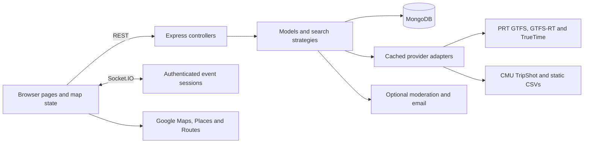

# ScottyGo code, development, and operations

This is the current implementation guide. [FEATURES.md](FEATURES.md) describes user behavior and screenshots; [API.md](API.md) lists HTTP and Socket.IO contracts. Historical audits, use cases, release logs, and design drafts are retained in Git history rather than duplicated under `docs/`.

## Structure

ScottyGo is one TypeScript application, with an Express server and a Parcel-built browser frontend. It uses standard HTML/CSS and custom elements rather than a frontend framework. Shared interfaces connect the client, server, and tests.

| Path | Responsibility |
| --- | --- |
| `client/pages/` | Five entry pages: map, authentication, account, subscriptions, notifications. |
| `client/scripts/components/` | Custom elements and focused UI: navigation, filters, search, location feedback, map key, tracking status, reports, notification popups. |
| `client/scripts/controllers/` | Map filtering, stop predictions, and walking navigation. |
| `client/scripts/state/` | Shared map state, filter controls, URL synchronization, navigation ownership/cancellation. |
| `client/scripts/maps/` and `renderers/` | Google Maps adapter and route drawing. |
| `client/scripts/trackers/` | Polling, one marker per vehicle, popup state, animation scheduling, and cleanup. |
| `client/scripts/services/` | Typed transit requests, geolocation ownership, walking directions, authentication, and pure vehicle-motion estimation. |
| `client/scripts/utils/`, `client/styles/` | Safe text/links, symbols, focus/zoom helpers, shared visual tokens, and page styles. |
| `server/serve.ts`, `server/app.ts` | Composition, HTTP/Socket.IO setup, initialization, feed lifecycle, and static assets. |
| `server/controllers/` | Route registration, validation, authentication/authorization, HTTP envelopes. |
| `server/models/` | Account, transit, and notification use cases; business rules. |
| `server/services/` | Provider adapters, feed polling, session validation, moderation/email, and diagnostics. |
| `server/db/` | `IDatabase` / DAC boundary, MongoDB/Mongoose implementation, test alternatives. |
| `server/search/` | Search strategies and shared text matching. |
| `common/` | Transit, account, map-provider, response, and Socket.IO interfaces. |
| `assets/` | CMU route metadata and static CSV geometry/stops used by the app. These are runtime data, separate from documentation screenshots. |
| `tests/`, `tools/` | Jest unit/integration/REST suites; build, Windows runtime, path validation, and opt-in transit E2E helpers. |
| `.dist/` | Generated client and server build, ignored by Git. |



Controllers are singletons assembled by `serve.ts`. Search behavior uses strategies; Socket.IO rooms distribute account and route events. Browser map access is wrapped by `IMapProvider` / `IMapMarker`, enabling focused tests without a live Google Maps instance.

## Initialization and transit data

1. Start the HTTP server, memory monitor, GTFS load, and MongoDB connection. Readiness is separate from the listening socket.
2. After MongoDB connects, enable memory persistence and seed `admin` only if absent. A reset requires explicit `ALLOW_DB_RESET=true` in DEV and is forbidden in PROD.
3. Await static GTFS loading, populate transit caches, and release parsing memory before starting live pollers. Downloads/CSV parsing stream with bounded attempts and deadlines to limit startup memory.
4. Poll PRT vehicle positions, PRT trip updates, and TripShot live status approximately every 30 seconds. Requests cannot overlap their own preceding poll. Stale data affects health; a repeated measurement does not acquire a new GPS timestamp.
5. Poll PRT service alerts every five minutes and broadcast changed snapshots. Initialize the last-known reported bus conditions and refresh transit caches every 24 hours.

PRT static GTFS supplies routes, stops, trip directions, schedules, and exact trip shape IDs. GTFS-RT supplies vehicles, arrivals, and alerts. TrueTime supplements route colors and detours; missing its optional key does not disable public GTFS feeds. CMU uses public TripShot live status and route metadata/geometry with static CSV support; it does **not** require the obsolete `TRIPSHOT_API_KEY` settings from early project drafts. Route IDs prefixed `CMU-` select that adapter. Stop UUIDs select CMU prediction data.

GTFS service dates use Pittsburgh's timezone and handle schedule times extending after midnight. Date/time route filtering represents scheduled availability, not replay or future vehicle simulation. Keep arrival prediction data separate from marker-motion estimates.

## Browser state and live movement

`MapStateManager` stores filters, measured vehicles, selected stops, GPS, and an optional planned origin. `URLSyncManager` serializes only public route/date/time/system/direction filters into `#/map?...`. `MapNavigationCoordinator` gives each navigation ownership of its requests; cancelled or older responses cannot replace a newer view. Directions temporarily own map graphics, then restore current filters on exit.

`FilterController` loads bulk routes/patterns/stops and registers geometry with `VehicleTracker`. Per-route fallbacks fill caches when bulk data is unavailable. `PredictionController` owns stop-card arrivals; `DirectionsController` owns walking navigation and cancellable Google Routes requests. `GeolocationController` owns exactly one watch, distinguishes permission denial from timeout/unavailability, and ignores late callbacks after retry/teardown. A planned point never counts as measured GPS.

The movement pipeline is:

```text
Provider GPS + source timestamp
  → immutable measured vehicle state
  → trip-shape/heading/continuity matching
  → observed speed and route-progress estimate
  → time/stop/distance confidence limits
  → one existing marker's display position
  → smooth correction when a newer GPS measurement arrives
```

The pure `vehicle-motion.ts` estimator has no Google Maps or timer dependency. It rejects duplicate/out-of-order observations as new motion evidence, checks implausible speed/jumps, resets on trip changes, and favors exact shape identity. Geometry compiles lazily; distance-along-path lookup avoids scanning the full route every frame. Correction and prediction update a single marker; raw positions remain available for report proximity and timestamps.

The model estimates unique source-report cadence rather than assuming every HTTP poll is a new GPS observation. A delayed measurement can still support motion. Generic mapped stops slow passage; a feed-announced next stop creates an approach, six-second dwell, and departure phase when movement evidence supports it. Explicit `STOPPED_AT` or zero-speed evidence holds position. Missing/ambiguous geometry, invalid time, detours, terminals, and off-route fixes constrain extrapolation. A provider outage freezes the displayed point until a distinct source report arrives, avoiding a jump back to the old raw fix.

| Motion safeguard | Current behavior |
| --- | --- |
| Start from delayed data | At most 120 seconds old when received; older data can be shown but does not start a forecast. |
| First-report forecast | Requires exact shape, fix within 15 meters, heading within 35°, and reported speed above 0.7 through 25 m/s; starts at 85% of reported speed, capped at 20 m/s. Otherwise wait for source-to-source progress evidence. |
| Adaptive continuation | Starts with a 60-second cadence; the first observed interval replaces that prior, and later intervals use a 0.6 previous / 0.4 new weighted average, bounded to 10–60 seconds. Motion spans the expected next unique update, normally 30–90 seconds after receipt, then decays over 20–45 seconds. |
| Absolute limits | No extrapolation beyond 180 seconds of source age or 3 km of route progress; earlier confidence/stop/terminal limits still apply. |
| Freshness | Fresh through 30 seconds, aging through 90 seconds, stale afterward. Stale classification alone does not disable a still-supported estimate. |
| Corrections | Slide the same marker for 600–4,000 ms along a shared shape, bounded to 3 km. Short off-shape corrections are bounded to 100 meters; implausible teleports snap rather than animating across the map. |
| Duplicate polls | Never renew source age, velocity evidence, or the forecast deadline. |

`VehicleTracker` owns polling, retention, source-health handling, accessible marker labels, and a shared animation loop. It does not create a second marker for predictions. Visible moving markers animate; hidden pages, reduced-motion mode, stationary vehicles, and exhausted estimates avoid unnecessary animation. Delayed markers have a 15-minute retention bound measured from the source timestamp, or first observation when the timestamp is unknown. Healthy authoritative removal clears the marker and its card. The UI keeps technical tracking information behind an explicit disclosure.

Never refresh measurement age from receipt time, use a predicted coordinate to authorize a report, or infer missing protobuf speed/status/bearing as zero. Optional feed fields are decoded only when present and valid; unknown observation time is an empty string. The estimator's confidence is an internal heuristic, not a calibrated probability or a promise of location accuracy.

## Accounts, persistence, and events

JWTs carry immutable `userId` and `tokenVersion`; server authorization reloads the active account. Password changes and deactivation invalidate old sessions. Passwords use bcrypt and are obfuscated in responses. Login and password-backed terms acceptance share an IP failure limit. Socket sessions authenticate on connect and inbound events, expire on time, and lose account rooms when privileges change.

| MongoDB model | Purpose and retention |
| --- | --- |
| `User` | Account identity, hashed password, terms, status, role, onboarding and session version. |
| `TransitCache` | Routes/stops/patterns/detours with unique keys and expiry TTL. |
| `SubscriptionSet` | One atomic bounded list per user; uniqueness and maximum ten routes enforced in the same update. |
| `Subscription` | Legacy individual records retained for migration/recovery. |
| `BusReport` | Submitted conditions and coordinates; indexed by bus/time. No automatic TTL currently. |
| `Notification` | Changed-condition events; 30-minute expiry and explicit recent-time filtering. |
| `MemorySample` | Runtime and startup-phase diagnostics; seven-day TTL. |

Existing individual subscriptions migrate lazily to a user's `SubscriptionSet`. Once present, the set is authoritative. Do not concurrently run an old writer against the same database. Rolling back to code predating this migration requires reconciling sets back into legacy records, including deletions; reverting application code alone does not revert persisted data.

Reports validate enums, numeric coordinates, nonempty answers, and comment length. Normal report submission requires a bus within half a mile; administrators have a server-side distance exemption. The frontend additionally blocks submission without usable GPS or sufficiently recent bus data. Moderation uses configured Gemini or a keyword fallback. Only changed condition fields publish a notification; identical answers still persist as reports without another event. Subscriptions persist in MongoDB, while mute preferences stay in browser storage.

Alert rendering preserves agency text as text nodes and creates only validated HTTP(S) links. Known cause/effect/severity metadata is retained without guessing urgency. Alert snapshots, local search, disclosures, focus, and partial failures are independently managed. Popup queues are bounded/deduplicated and pause while read, focused, or hidden. Page/BFCache lifecycle handlers clean up requests, timers, and sockets.

## Run locally

Use **Node.js `^24.19.0`**, npm `>=10.8.0`, MongoDB, and `unzip` on PATH. The deployment branch is Windows-safe; the historical main branch may contain filenames Windows cannot check out.

```powershell
git clone --branch codex/render-atlas-setup https://github.com/Naihe0/s26-fse-scottygo.git
cd s26-fse-scottygo
npm ci
Copy-Item .env.template .env
```

Configure `.env` privately. The application concatenates `DB_URL` and the selected database suffix exactly:

```dotenv
ENV=LOCAL
STAGE=DEV
ALLOW_DB_RESET=false
BIND_ADDRESS=127.0.0.1
LOCAL_HOST=http://localhost
PORT=8080
DB_URL=mongodb://127.0.0.1:27017
DEV_DB=/ScottyGoLocal
PROD_DB=/ScottyGoLocal
```

Add a private `JWT_KEY`, `INITIAL_ADMIN_PASSWORD`, and a Google Maps key. Never commit `.env` or credentials. Optional keys are described below. With MongoDB running, `npm run build` then `npm start` serves [localhost:8080](http://localhost:8080); `npm run watch` rebuilds/restarts on source changes.

### Windows background helper

```powershell
npm run local:start
npm run local:status
npm run local:stop
```

`tools/local.ps1` runs the app and MongoDB in hidden processes bound to loopback, reuses its own running instances, verifies identities before stopping, and preserves data. It requires installed npm dependencies, Git for Windows, and a portable MongoDB at `%LOCALAPPDATA%\ScottyGo\mongodb-*\bin\mongod.exe`. It prefers portable Node 24 under `%LOCALAPPDATA%\ScottyGo\node-v24*-win-x64`, falling back to PATH. The helper does not install runtimes.

Local persistent data is under `%LOCALAPPDATA%\ScottyGo\data\s26-fse-scottygo`; logs are under `%LOCALAPPDATA%\ScottyGo\logs\s26-fse-scottygo`. PID state is in ignored `tmp/local-runtime.json`. The helper sets local database/binding variables for its children and adds Git's `unzip` to their PATH. It builds only if the server build is absent; after editing source, **stop → build → start** explicitly. A separate test shell must add `unzip` itself if testing real GTFS downloads.

An initial DEV database can use the legacy `admin` password fallback; set a private initial password before use. Existing accounts are never reset by changing `INITIAL_ADMIN_PASSWORD`. Local MongoDB and the hosted Atlas database are separate.

## Render and Atlas

The personal service is [scottygo-ningrui](https://dashboard.render.com/web/srv-dan0p6jm8hqs739kant0), connected to `Naihe0/s26-fse-scottygo`, branch `codex/render-atlas-setup`. The original project service uses its own deployment/database.

| Render setting                    | Value                                   |
| --------------------------------- | --------------------------------------- |
| Runtime / root                    | Node, repository root                   |
| Build                             | `npm ci --include=dev && npm run build` |
| Start                             | `npm start`                             |
| Health path                       | `/transit/health`                       |
| Current deployment region / class | Virginia / Free                         |

Development dependencies are needed to build Parcel. Runtime uses a 320 MB heap cap and exposed GC for the small instance. Keep `assets/` available and `unzip` installed. On stale-install failures, clear Render's build cache before redeploying.

Create an Atlas database user with `readWrite` on `ScottyGoPROD` only. Allow the outbound IP ranges shown by this Render service in Atlas Network Access; use the dashboard's current ranges. Keep the database password and service secrets in Render environment settings.

| Environment variable | Purpose |
| --- | --- |
| `ENV=RENDER`, `STAGE=PROD` | Hosted mode and production protection. |
| `RENDER_HOST` | `https://scottygo-ningrui.onrender.com` for this deployment. |
| `DB_URL` | `mongodb+srv://<db-user>:<encoded-password>@<atlas-host>` without database path/query. |
| `PROD_DB` | `/ScottyGoPROD?retryWrites=true&w=majority`. |
| `JWT_KEY` | Private random signing key, at least 32 characters in PROD. |
| `INITIAL_ADMIN_PASSWORD` | Private bootstrap password, at least 12 characters in PROD. Seeds only an absent `admin`. |
| `JWT_EXP` | Production token lifetime; this deployment uses `7d`. Code default is `365d`; DEV uses nonexpiring tokens. |
| `GOOGLE_MAPS_KEY` | Browser key restricted to approved service/local origins with Maps JavaScript, Places, and Routes enabled. It is intentionally delivered to the authenticated browser, so origin/API restrictions matter. |
| `TRUETIME_KEY` | Optional PRT colors/detours integration. |
| `GEMINI_API_KEY`, `GEMINI_MODEL` | Optional moderation provider/configuration. |
| `BREVO_API_KEY`, `EMAIL_USER`, `EMAIL_FROM_NAME` | Optional account-status email and sender. `EMAIL_APP_PASSWORD` is unused. |

Render provides `PORT`; leave `BIND_ADDRESS` unset there. Encode reserved characters in an Atlas password before constructing its URI. PROD rejects missing/placeholder JWT and bootstrap secrets, and never permits database reset.

## Verification and release

```text
npm run lint
npm run typecheck
npm run build
npm run test:unit
npm run test:integration
npm run test:rest
npm run check:paths
```

`npm run prepush:check` runs lint, type checks, production build, and unit checks without rewriting files. Unit tests need no database. Integration/REST suites use **disposable loopback MongoDB only**: default `mongodb://127.0.0.1:27019/scottygo_test`. An override must name `scottygo_test` or `scottygo_test_*`, with no remote hosts or credentials. Tests clear collections, unset external email/AI credentials, and run DB suites sequentially. Never run concurrent commands against the same test database.

`npm run test:rest:e2e:transitAPI` explicitly opts into real provider downloads and requires `unzip`, disposable MongoDB, and working upstream services. Use focused deterministic tests for estimator time, out-of-order reports, route branches, stops, correction continuity, one-marker ownership, request cancellation, and progressive disclosure. Browser acceptance should cover desktop and phone layouts, actual map focus/selection, keyboard controls, permission recovery, details expansion, and alert links. Keep synthetic bus/location/report scenarios on a local test origin and database.

After pushing application changes, verify Render's deployed commit and Live status, then separately check readiness:

- `/transit/health` is HTTP 200 for liveness. Require `overall: true`, `gtfs.ready: true`, and fresh feed timestamps before calling transit ready. GTFS/caches can need several minutes after a cold start.
- Verify `/auth`, `/`, `/account`, `/subscriptions`, `/notifications`, and their referenced JS/CSS assets; sign in and inspect map configuration without logging tokens/keys.
- Check PRT/CMU route catalogs, geometry, live vehicles, arrival/alert sources, and a current persisted memory sample.
- Review the deployed browser at desktop and phone width. Do not submit production reports or alter user subscriptions merely for a smoke test.
- Stop temporary local app/test database processes after verification and reset browser viewport overrides.

Record release identity in Git commits and the deployment platform. These three guides describe the current system rather than accumulating per-cycle logs. If replacing screenshots, capture the implemented UI and avoid credentials, personal location, or fabricated production reports.

## Diagnostics and constraints

The memory monitor samples every five seconds, tracks RSS/heap/external memory and startup phases, warns at 420 MB RSS, and flags critical at 460 MB. `/transit/memory/dashboard` provides a graph, peak/critical drilldowns, reload, and CSV export. Samples persist for seven days. Examine startup phases and sustained slope rather than treating a single RSS peak as a leak. These diagnostic endpoints are currently public.

| Symptom | Check |
| --- | --- |
| Windows clone fails on invalid filenames | Clone the Windows-safe deployment branch above. Do not weaken Git path protection. |
| Routes absent immediately after deployment | Read GTFS readiness, feed health/timestamps, and startup logs; wait for initialization. |
| Server cannot connect to Atlas | Database user/role, URI encoding, database suffix, and Render outbound allowlist. |
| Map or walking route fails | Authorized Maps origin and enabled APIs; browser error feedback; network timeout. |
| iPhone location unavailable despite site Allow | Device Location Services, browser-level access, actual error type, then Try again. |
| `unzip ENOENT` | Add Git for Windows' `usr\bin` to the process PATH; this is not an empty feed. |
| UI still shows old code locally | Rebuild, restart the correct process, and refresh; use `npm run clean:build` if generated artifacts are stale. |
| Prediction stops | Inspect report age, stop/status/speed evidence, shape ambiguity, limits, and source health. Do not force arbitrary movement to hide an outage. |

Known boundaries: a single Render process and in-memory feed state, no background push/native application/offline support, no pagination for the short notification window, no automatic bus-report retention policy, and provider-limited observation cadence. Any future horizontal scaling must coordinate Socket.IO rooms, caches, rate limits, and subscription/report writers. Browser authentication currently stores bearer tokens in local storage, making safe text rendering and avoidance of script injection especially important.
