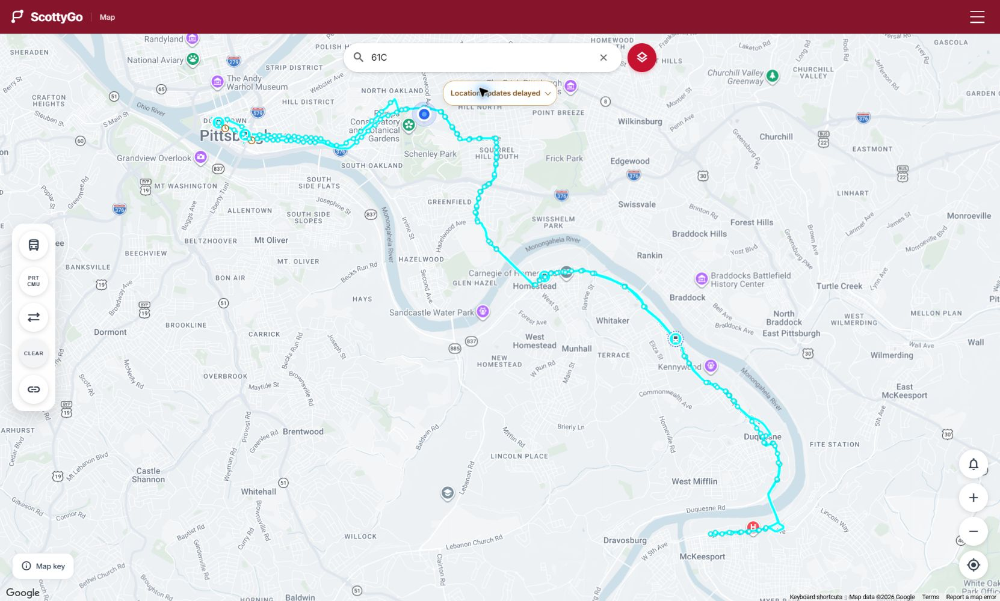
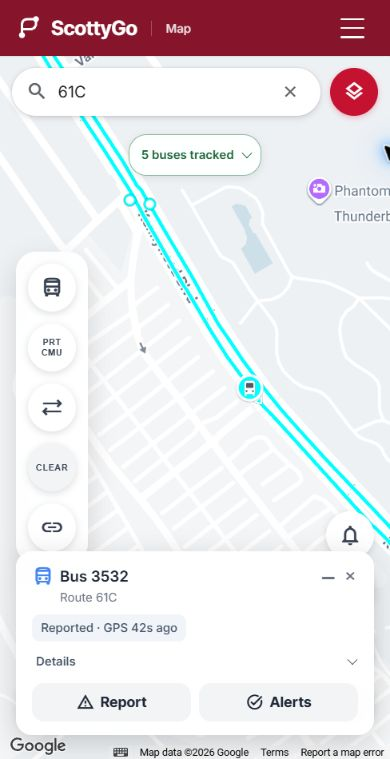
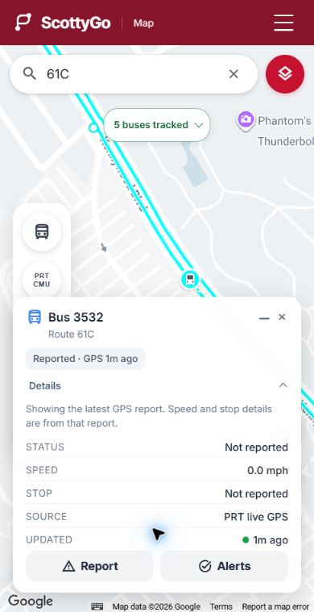
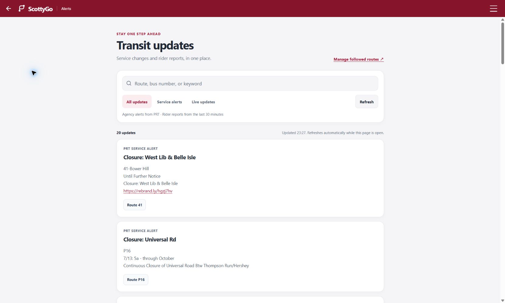

# ScottyGo features and current screens

ScottyGo combines Pittsburgh Regional Transit (PRT) buses and CMU shuttles in one map. The current personal deployment is [scottygo-ningrui.onrender.com](https://scottygo-ningrui.onrender.com/). This guide describes the implemented app; [ARCHITECTURE.md](ARCHITECTURE.md) covers development and operations, and [API.md](API.md) describes its interfaces.

## Map and route discovery

After signing in, the map starts near your location when permission is available, or near CMU campus otherwise. Search by route number, route name, stop name, or stop ID. Selecting a result opens that route or stop without requiring you to find it manually on the map.

| Control or action | What it does |
| --- | --- |
| Route filter | Choose a route and inspect its operating days, first/last trips, directions, alerts, and available detours. |
| PRT / CMU filter | Show either transit system or both. PRT is the default. |
| Direction filter | Show inbound, outbound, or both. CMU loop services may have only one available direction. |
| Shared schedule filters | A shared map URL can carry date/time filters for scheduled service; the current map toolbar exposes route, system, and direction controls. Schedule filters do not simulate future bus positions. |
| Route paths and stops | View colored route geometry, direction cues, stop markers, and available detour overlays. Selected routes receive stronger emphasis. |
| Zoom and recenter | Adjust the view or return to a close view around your location, approximately a 200-meter radius where the viewport allows it. |
| Map key | Explain route, stop, bus, estimated-position, delayed-position, and personal-location symbols. |
| Clear all filters | Restore default route/date/time/system/direction filters and close their panels. A chosen planning location is preserved. |
| Copy view link | Share the current route and filters. Coordinates, planned locations, query strings, and account tokens are excluded. A manual-copy dialog appears if clipboard access fails. |
| Browser Back / Forward | Restore the previous route/filter view. A shared view also survives the sign-in flow. |

### Current desktop map

### Current phone layout

The screenshots are captures of the current app in a local preview, replacing the historical design mockups. The location is a fixed CMU demonstration point, not a user's personal location. Bus data and agency notices come from public feeds and are snapshots rather than fixed examples.

## Live buses and movement

Each bus has **one circular marker**, containing a bus symbol, with a triangle indicating its heading when known. Tapping it centers and zooms the map to that bus. Its compact card identifies the route/bus and the position state, with **Report** and **Alerts** actions immediately available. Expand **Details** for additional tracking information. The map's tracking banner provides a brief status; tap it to see more information. Keyboard users can open either disclosure and close it with Escape.

Between actual GPS reports, the marker estimates motion along the known route. It uses the trip's shape when available, observed route progress, heading, speed, and stop information. Eligible moving buses continue updating between network refreshes, including when the latest report is already delayed on arrival. New actual reports correct the **same marker** by sliding it toward the updated position. No separate predicted or actual marker is drawn.

Reported, estimated, and delayed states remain distinguishable. A delayed position can remain visible for up to 15 minutes; an authoritative healthy feed can remove a bus that is no longer present. Predicted movement slows near mapped stops, and a reported next stop can trigger a brief dwell before departure. Explicit stopped/zero-speed observations hold position. Prediction also stops when evidence is too weak, a terminal is reached, or its time/distance bounds are exhausted. A provider outage pauses the marker where it is until a distinct report arrives. Animation honors reduced-motion preferences and pauses in hidden tabs.

The moving icon is an estimate, not a new GPS measurement. It does not change the source report time, arrival predictions, or the real coordinates used to check whether a rider is near a bus.

### Selected bus and details

## Stops, arrivals, and walking

Select a stop to see the serving routes, upcoming arrivals, delay indicators, and estimated walking time when a starting location is available. Predictions refresh while the stop card remains open. Empty results and unavailable data have separate messages; a scheduled route is not a promise that a live bus or arrival estimate currently exists.

Nearby-stop discovery uses the current or planned starting point and respects the selected filters. A rider can choose **Set a different location** through Places search, then return to **Current Location** later. A planned point helps with route discovery and walking directions, but does not grant GPS access or establish proximity for a bus report.

The Directions action starts walking navigation to a stop, showing its path and step instructions. GPS updates support progress and rerouting. Loading can be cancelled; failed requests time out and restore the map rather than leaving it locked. Exiting directions restores the latest selected map filters.

## Location access and recovery

Your location uses a distinct high-contrast marker and accuracy treatment. Recenter explicitly requests a closer view; ordinary GPS updates do not repeatedly take over your chosen zoom or interrupt a selected stop or active directions.

Location feedback distinguishes blocked permission, timeout, unavailable position, and unsupported browser. The map remains usable. **Try again** restarts location acquisition; the blocked-permission message offers expandable settings help. Browser-level permission and the device's location permission both need to allow access. A successful retry clears the feedback and restores location-dependent actions. The app cannot override a device setting itself.

On phones, controls and sheets use the available viewport and safe-area spacing. Keyboard focus, touch targets, wrapping text, and reduced motion are supported. Desktop browser tests at phone dimensions do not replace acceptance on a physical iPhone.

## Alerts and rider updates

The **Notifications** page offers **All updates**, **Service alerts**, and **Live updates**. Search remains within the selected view. Service alerts come from PRT; live updates are rider reports from the last 30 minutes.

- Agency cards identify affected routes and show supplied effect, cause, severity, and notice dates when available. Missing metadata is not invented. Long descriptions and large route lists expand on demand.
- Explicit HTTP(S) links in agency text and rider comments are clickable. Unsafe link schemes and embedded markup are not executed. Agency-source links open separately; route chips open the affected route on the map.
- Rider cards identify the bus, route, reported changes, and age. They remain distinct from agency alerts. Relative time is accompanied by an accessible absolute timestamp.
- Refresh, foreground polling, and live events update results without clearing the search or expanded details. If one source fails, successful data remains visible with a source-specific message.
- Foreground popups link to the route and update history. They are bounded and deduplicated, pause dismissal while being read or focused, and can be dismissed directly.

### Current alert center

These are notifications inside the open web app. Background push, lock-screen notifications, an offline map, an installable PWA, and a native iOS app are not implemented.

## Saved routes and reports

The **Subscriptions** page saves up to **10 routes per account**. Add a PRT or CMU route, open its map, remove it, or mute its foreground popups. Saved routes persist on the server. Mute choices are stored in this browser and do not remove the saved route.

To report bus conditions, select a bus and open its report action. Choose any combination of crowdedness, priority-seat availability, vehicle condition, and an optional comment of up to 200 characters. At least one answer is required. The normal proximity limit is half a mile from the bus's reported location; the browser also requires usable GPS and a recent bus report. Delayed or predicted display coordinates never substitute for measured proximity. Administrators have a server-side proximity exemption, but still use the browser's location/freshness safeguards.

Changed conditions create a live route update. An identical condition report does not create another notification. Comments pass moderation; a flagged comment can be omitted while valid condition answers are accepted. The submission result explains that outcome.

## Accounts and navigation

Registration requires a unique username, a CMU email address, a valid password, and the terms flow. Inline validation explains invalid fields. Sign in, sign out, page navigation, a first-use map tour, and account editing are available from the app shell.

| Role / state | Available account actions |
| --- | --- |
| Member or Coordinator | View and edit their own username, CMU email, and password; deactivate their own account. Coordinator currently has the same account-management scope as Member. |
| Administrator | Search/select users, edit accounts, change Active/Inactive status, and assign Member, Coordinator, or Administrator privilege. |
| Inactive account | Cannot authenticate or keep using an active session; an administrator must reactivate it. |

The last active administrator cannot be removed through deactivation or demotion. Password changes revoke previous sessions; account changes are reflected in connected views. Optional account-status emails are sent only when the deployment has email configured. Changing a username preserves the immutable account identity and saved routes.

## Operational visibility and limitations

The [memory dashboard](https://scottygo-ningrui.onrender.com/transit/memory/dashboard) shows process memory, historical samples, peak context, and CSV export. It complements the transit health endpoint described in [API.md](API.md).

Live transit and directions depend on their upstream services and the network. Startup can temporarily show no route data while GTFS and caches load. The app distinguishes readiness, delayed measurements, provider failure, and valid empty results where those signals are available. A Free Render service can sleep; the foreground app cannot guarantee continuous background delivery while its server is asleep.
